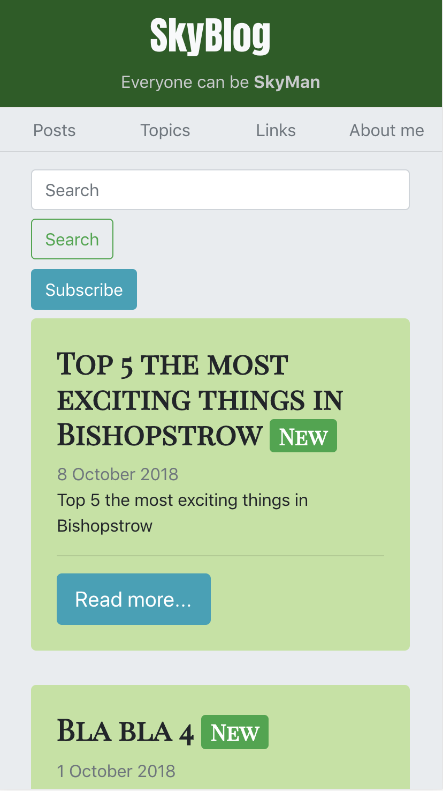
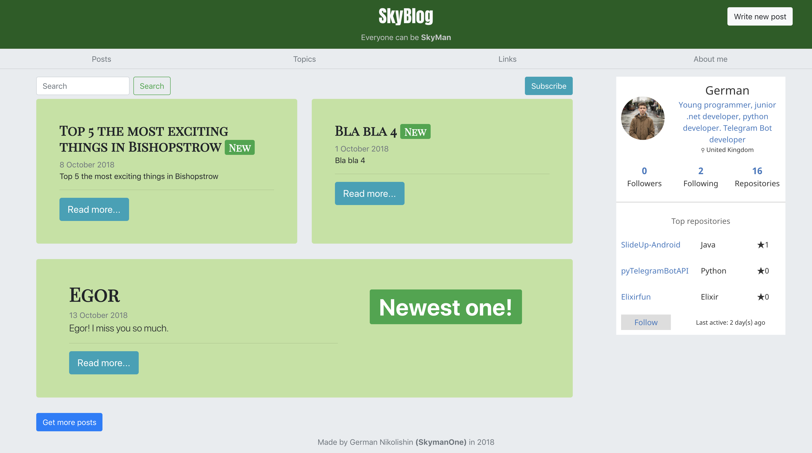
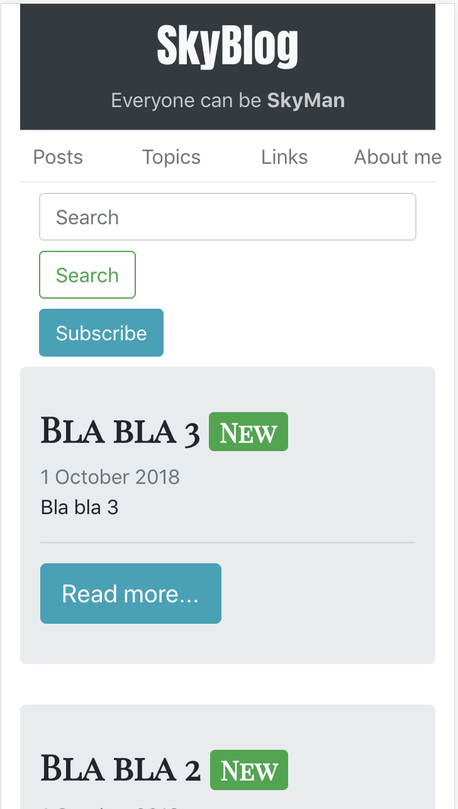
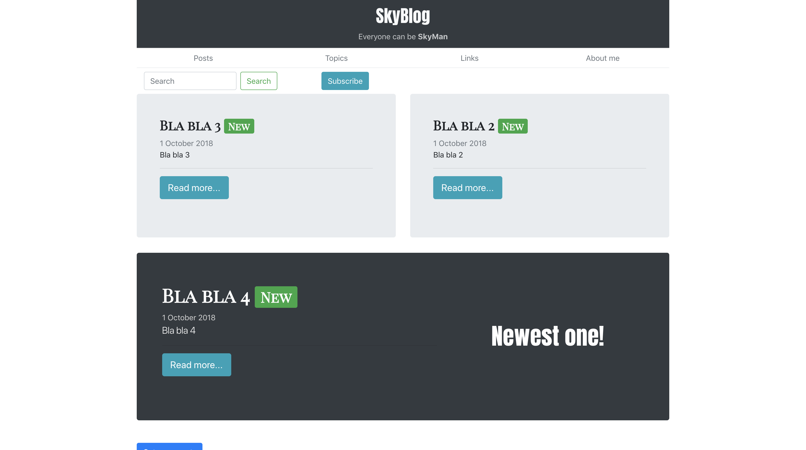

# SkyBlog
  

## Introduction 
This projects is made for practice programming skills. I've decided to develop it on Python (Flask Framework), because I needed light and customisable tools, and the another reason was my preference to build something from nothing.


## List of dependencies
* flask
* flask_sqlalchemy
* flask_marshmallow

## Updates
New design. Stable version has been developed

### Mobile version 2.0
 </img>
### Desktop version 2.0
</img>

### Mobile version 1.0
 </img>
### Desktop version 1.0
</img>

## Goals
* Login system (**done**)
* Post system (**done**)
	* Creating posts 🛠 (**done**)
	* Editing posts 📝 (**done**)
	* Deleting posts ❌ (**done**)
	* Tag system 📲 (**done**)
	* Search by tags and names (**done**)
* Ajax queries (**done**)
* Comments (**done**)
* Page about myself (**done**)
* Material design (**done**)
* RSS


## Cotribution 
In order to run web application on you server, you need to init you database. To do this: enter `flask db init` in terminal in your environment.
Then migrate your databse in order to create tables from models: enter `flask db migrate -m "init"` and run `flask db upgrade`

After that you need to create admin user in order to be able to create posts
Run `python3` and insert following code
```python
>>> from app.models import User
>>> u = User(username='yourname', email='email@example.com')
>>> u.set_password('yourpassword')
>>> db.session.commit()
```

### Email: [german.nikolishin@gmail.com]()
